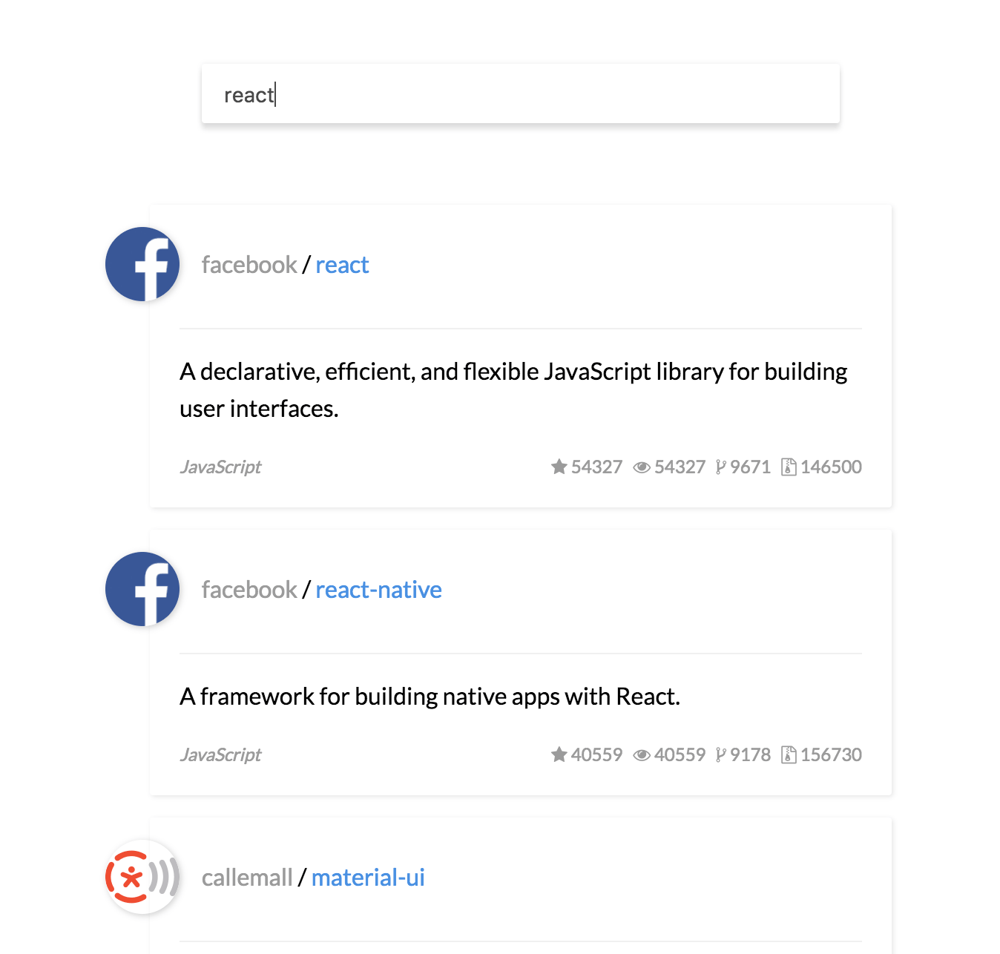
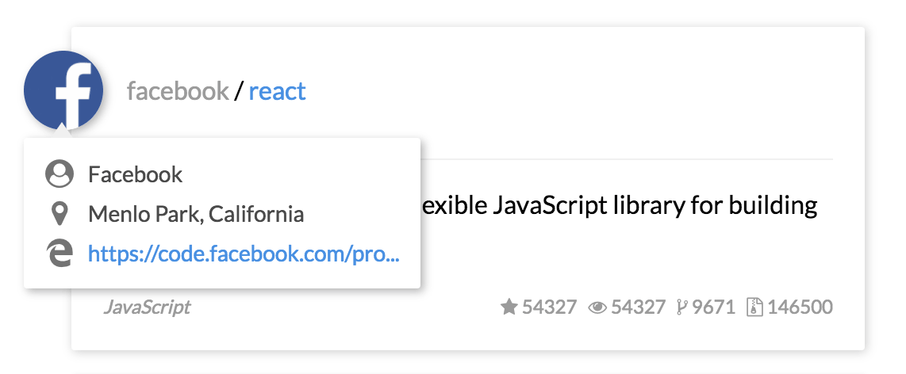

# rxjs-example

通过构建一个简单的 github 应用，学习 RxJS 的快速入门教程。线上 DEMO 可戳 [https://ecmadao.github.io/rxjs-example](https://ecmadao.github.io/rxjs-example/)

## 开始前的准备

- 使用 ES6 语法
- 通过 webpack/webpack-dev-server 进行编译
- 通过[探索 RxJS - Core Concept](https://github.com/ecmadao/Coding-Guide/blob/master/Notes/RxJS/%E6%8E%A2%E7%B4%A2RxJS-CoreConcept.md)学习 RxJS 的核心概念

## 本地跑起来

```bash
$ git clone https://github.com/ecmadao/rxjs-example.git
$ cd rxjs-example
$ npm i
$ npm run dev-server
```

然后打开`http://localhost:8080/webpack-dev-server`即可

## 展示

- 通过`RxJS`，在输入过程中实时进行异步搜索：



- `hover`到 avator 上之后异步获取用户信息



## 教程目录

> 猛戳这里看教程：[探索 RxJS - 做一个 github 小应用](https://github.com/ecmadao/Coding-Guide/blob/master/Notes/RxJS/%E6%8E%A2%E7%B4%A2RxJS-%E5%81%9A%E4%B8%80%E4%B8%AAgithub%E5%B0%8F%E5%BA%94%E7%94%A8.md)

- [初始化 DOM 事件流](https://github.com/ecmadao/Coding-Guide/blob/master/Notes/RxJS/%E6%8E%A2%E7%B4%A2RxJS-%E5%81%9A%E4%B8%80%E4%B8%AAgithub%E5%B0%8F%E5%BA%94%E7%94%A8.md#初始化-dom-事件流)
- [实时进行异步获取](https://github.com/ecmadao/Coding-Guide/blob/master/Notes/RxJS/%E6%8E%A2%E7%B4%A2RxJS-%E5%81%9A%E4%B8%80%E4%B8%AAgithub%E5%B0%8F%E5%BA%94%E7%94%A8.md#实时进行异步获取)
- [优化事件流](https://github.com/ecmadao/Coding-Guide/blob/master/Notes/RxJS/%E6%8E%A2%E7%B4%A2RxJS-%E5%81%9A%E4%B8%80%E4%B8%AAgithub%E5%B0%8F%E5%BA%94%E7%94%A8.md#优化事件流)
- [流的监听](https://github.com/ecmadao/Coding-Guide/blob/master/Notes/RxJS/%E6%8E%A2%E7%B4%A2RxJS-%E5%81%9A%E4%B8%80%E4%B8%AAgithub%E5%B0%8F%E5%BA%94%E7%94%A8.md#流的监听)
- [更加优雅的 Rx 风格](https://github.com/ecmadao/Coding-Guide/blob/master/Notes/RxJS/%E6%8E%A2%E7%B4%A2RxJS-%E5%81%9A%E4%B8%80%E4%B8%AAgithub%E5%B0%8F%E5%BA%94%E7%94%A8.md#%E6%9B%B4%E5%8A%A0%E4%BC%98%E9%9B%85%E7%9A%84-rx-%E9%A3%8E%E6%A0%BC)
- [创建基于`hover`的事件流](https://github.com/ecmadao/Coding-Guide/blob/master/Notes/RxJS/%E6%8E%A2%E7%B4%A2RxJS-%E5%81%9A%E4%B8%80%E4%B8%AAgithub%E5%B0%8F%E5%BA%94%E7%94%A8.md#%E5%88%9B%E5%BB%BA%E5%9F%BA%E4%BA%8Ehover%E7%9A%84%E4%BA%8B%E4%BB%B6%E6%B5%81)
